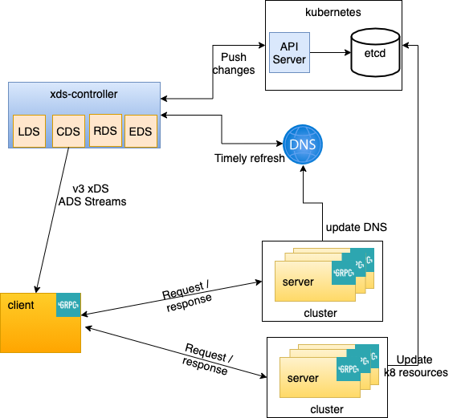

# xds-controller
[](https://goreportcard.com/report/github.com/pradeepmvn/xds-controller)

A general purpose control-plane to provide endpoints for grpc clients. Also well known as `Lookaside Loadbalance` implementation via Envoy xDS API. This can be deployed directly in a container with provided cluster configurations and grpc clients can connect to it for look aside loadbalancing. This repo is specific to create EDS.. which is general pupose need for microservices and deployment with in a kubernates cluster. It is built using the envoy [go-control-plane](https://github.com/envoyproxy/go-control-plane) itself.


## Features:
1. v3 Envoy resources & API support
2. Multiple Resolvers
    -  dns : A dns service with A records that can be used to LB requests
    -  k8 (Kubernates): A list of ips for a headless k8 service deployment
3. Ability to identity delta between snapshot and only send if there is a change.
4. Plugged in to k8 watch and detect changes with k8 endpoints
5. Mix and match resolvers for cluster. For ex: a node can have 1 dns resolver and 1 k8 resolver
6. xDS transport protocol: Aggregated Discovery Service (ADS): SotW, aggregate stream for all resource types with grpc-streams

## Solution Overview


## What is xDS
 - xDS is the protocol initially used by Envoy, that is evolving into a universal data plan API for service mesh.
 - Envoy can be deployed in a Fully static configuration mode or xDS.
    - In a fully static configuration, the config map provides a set of listeners (and filter chains), clusters, etc. Dynamic host discovery is only possible via DNS based service discovery.Configuration reloads must take place via the built in hot restart mechanism.
    - Or you can configure xds-controller into envoy and discover endpoints.
- To achive Lookaside LB, the client needs to ask  for endpoints, get information about Loadbalancing among them etc.. This communication happens using xDS protocol.
- xDS stands for `x` Discovery Servies, wehere in you can replace `x` with any one below discovery service.
    - LDS: Listener Discovery, Ports that Envoy listens on and take on incoming connections
    - RDS: Route discovery, grpc routes for incoming requests
    - EDS: Endpoint discovery, cluster memebers and their Ips
    - CDS: Cluster discovery, upstream clusters
    - LRS: Load Reporting Service
    - ADS: Aggregated Discovery Service, A composite of all the details above availvle in ADS srteam
    All the above resources are needed for a sucessfull Lookaside LB implementation.
- On client side,
  - the xDS resolvers need to be loaded
  - Bootstapfile containing xds-controller server details should be provided
```
_ "google.golang.org/grpc/xds" // To install the xds resolvers and balancers with in a main program.

export GRPC_XDS_BOOTSTRAP=/path/to/bootstrap.json
```
- On server side, No Specific xDS changes are needed if the control plane resolves endpoints from an external resource such as k8 or dns.This repo enables the usage of both k8 type discovery and dns type discovery

## Sample xDS Bootstrap file on the client
```
{
  "xds_servers": [
    {
      "server_uri": "dns:///xds-controller.xds-test.svc.cluster.local:8080",
      "channel_creds": [
        {
          "type": "insecure"
        }
      ]
    }
  ],
  "server_features": [
    "xds_v3"
  ],
  "node": {
    "id": "THIS_IS_THE_SNAPSHOT_ID_THAT_MATCHES_TO_XDS_CONTROLLER"
  },
  "grpc_server_resource_name_id": "grpc/server"
}
```
## Instrumentation
This project currently uses Promethus client for golang and exposes all standard metrics for golang client. This includes goroutines, gc collection times etc. Along with these blow custom metrics are defined and exported via Prometheus Agent. 

| Metric | Type | Description |
|---|---|---|
| active_streams | Gauge | Active grpc stream connections to  xds-controller at a given point in time | 
| stream_requests | Counter| No.of requests via grpc streams to xds-controller | 
| stream_responses | Counter| No.of Reponses sent to clients by  xds-controller | 

The [example](https://github.com/pradeepmvn/xds-controller/tree/main/example) refers multiple service ports by xds-controller which can be used by a prometheus server to scrape metrics.

## Configuration
| Configuration | Details |
|---|---|
| node_id | String to be used when creating snapshot in the cache. This has to be referenced in client Bootstrap file | 
| log_debug | Enable debug logs  true|false | 
| listner_port | Port on which the xds-controller has to run | 
| max_concurrent_streams | Streams to grpc clients per container/pod | 
| clusters. name| Unique name of the lcuster across others | 
| clusters. resolver_type| Currenlty supported types include k8 and dns | 
| clusters. address| address which is to be resoved. either a dns o a k8 service name | 
| clusters. name_space| name space to filter k8 resources. Used only for k8 resolver | 
| clusters. port| Port on which the service runs | 
| clusters. refresh_interval_in_sec| Refresh time for Endpoints. Only used for DNS type | 
| clusters. lb_policy| Envoy supported load balancer policies such as ROUND_ROBIN ,LEAST_REQUEST | 

## Example Usage
See [Example](https://github.com/pradeepmvn/xds-controller/tree/main/example) directory for usage.

## References
Great projects that helped to shape it up. A big thanks for these repos. Some of these are very useful informational blogs to describe how connectivities are happening.

- https://github.com/envoyproxy/go-control-plane
- https://github.com/grpc/grpc-go/blob/master/examples/features/xds/README.md
- https://www.envoyproxy.io/docs/envoy/latest/intro/arch_overview/operations/dynamic_configuration
- https://github.com/asishrs/proxyless-grpc-lb
- https://cloud.google.com/traffic-director/docs/configure-stackdriver
- https://github.com/envoyproxy/learnenvoy
- https://github.com/grpc/proposal/blob/master/A27-xds-global-load-balancing.md#xdsclient-and-bootstrap-file
- https://blog.christianposta.com/envoy/guidance-for-building-a-control-plane-to-manage-envoy-proxy-based-infrastructure/
- https://www.solo.io/blog/building-a-control-plane-for-envoy/
- https://rancher.com/using-kubernetes-api-go-kubecon-2017-session-recap
- https://github.com/tcfw/go-grpc-k8s-resolver

## FAQ
1. Can I use load balancing with a clusterIp or a loadbaalncer ip for my service?
- No. Cluster IP uses k8 internal proxy to loadbalance request across multiple pods. Enabling cluster ip will have once


